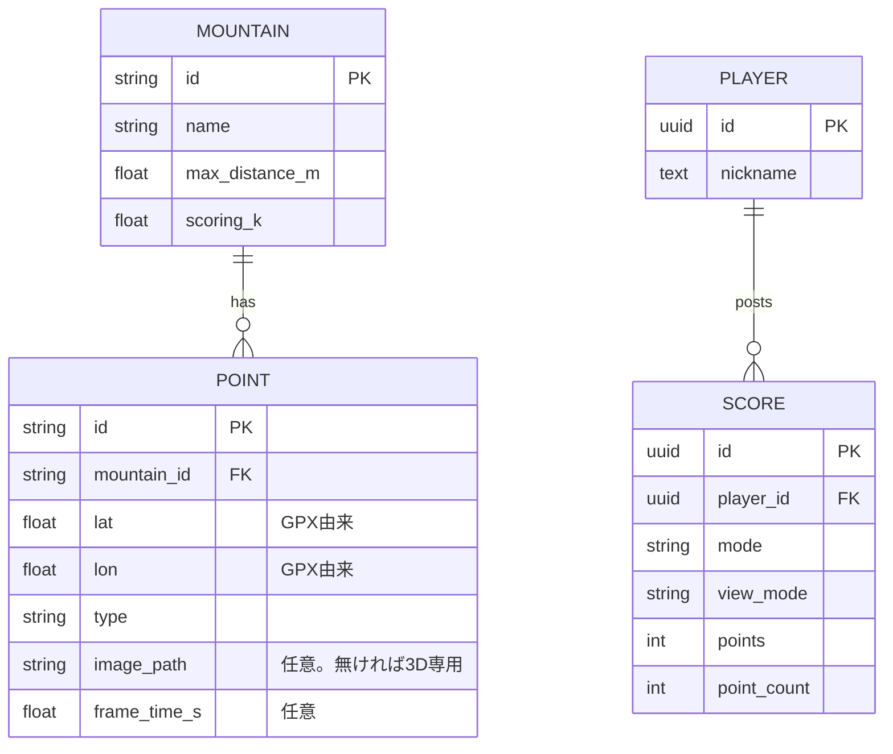

# データモデル

出題データ（Mountain / Point）は**静的JSON**（`public/data/quiz_points.json`）、スコア関連（Player / Score）のみ**Supabase**に置く。両者は別ストレージなので直接のFK制約は無く、`SCORE.mountain_id`はJSON側のIDを緩く参照する。



## quiz_points.json（静的、`public/data/`配下）

```json
{
  "dataset_version": "2026-07-29T12:00:00Z",
  "mountains": [
    {
      "id": "yamada-2026-07-11",
      "name": "◯◯山",
      "max_distance_m": 850,
      "scoring_k": 4,
      "track_path": "data/tracks/yamada-2026-07-11.json"
    }
  ],
  "points": [
    {
      "id": "yamada-2026-07-11-003",
      "mountain_id": "yamada-2026-07-11",
      "lat": 34.1851909,
      "lon": 136.1093076,
      "type": "peak",
      "image_path": "images/yamada-2026-07-11/003.webp",
      "media_id": "DJI_20260711125358_0029_D",
      "frame_time_s": 41.5,
      "heading_deg": 128.4,
      "heading_route_deg": 121.0,
      "source": "auto"
    },
    {
      "id": "yamada-2026-07-11-004",
      "mountain_id": "yamada-2026-07-11",
      "lat": 34.4041,
      "lon": 135.8790,
      "type": "col",
      "heading_route_deg": 98.0,
      "source": "auto"
    }
  ]
}
```

| フィールド | 説明 |
|---|---|
| `dataset_version` | 生成日時ベースの文字列。全地点制覇の進捗互換性判定とスコア記録に使う |
| `Mountain.max_distance_m` | スコア計算の最大距離。GPXルートのバウンディングボックス対角線 × 0.5（厳しめ、[pipeline.md](pipeline.md)参照） |
| `Mountain.scoring_k` | スコア減衰の急峻さ係数（既定4、大きいほど厳しい） |
| `Mountain.track_path` | 地形図に描くGPXトラック（GeoJSON LineString）のパス。山ごとの別ファイルで、遊ぶ山のぶんだけ読み込む。GPX無しで作った山では省略 |
| `Point.lat/lon` | **GPXルート上にスナップ済みの座標**（生GPSではない。理由は[spec.md](spec.md)の設計判断表） |
| `Point.type` | `bend`(ルート屈曲) / `ridge_view`(尾根谷が見える) / `ridge_start`(尾根に乗り始め) / `peak` / `col` / `manual`(手動追加) |
| `Point.elevation_m` | 地理院DEM由来の標高。**3Dビューで視点をこの高さに置く**ためにフロントへ渡す（タイル読み込みを待たずに正しい視点を作れる） |
| `Point.image_path` | **任意**。省略された地点は画像を持たず、**モード②（3D地形）専用**として出題する（[spec.md](spec.md)の設計判断表） |
| `Point.media_id` | 画像の出所メディア（分割動画・後から足した素材の識別）。画像が無い地点では省略 |
| `Point.frame_time_s` | レビューで確定した切り出し時刻（動画先頭からの秒）。画像が無い地点では省略 |
| `Point.heading_deg` | カメラ方位。モード②の3Dビュー初期視点に使用。算出不能な場合は省略し、`heading_route_deg`（進行方位）で代用する |
| `Point.heading_route_deg` | GPXルートの進行方位。`heading_deg`が無い地点のフォールバック |
| `Point.source` | `auto`（自動検出→採用）／`manual`（レビュー時に人間が追加） |

**含めないもの**：生GPS座標、`snap_distance_m`、品質スコア（`blur_score`等）、`aux1`/`aux2`。これらは中間ファイル（`pipeline/data/`）に留め、公開JSONには出さない（不要な情報を配信しないため）。

## トラック（`public/data/tracks/{mountain_id}.json`）

地形図に重ねて描くルート。GeoJSON の LineString Feature 1つだけを持つ。

```json
{
  "type": "Feature",
  "properties": { "mountain_id": "yamada-2026-07-11" },
  "geometry": { "type": "LineString", "coordinates": [[135.877, 34.403], ...] }
}
```

- 元のGPXを Ramer–Douglas–Peucker で**許容誤差8mまで間引く**（実績：425点 → 100点 / 2.6KB）。地形図の縮尺では元の線と区別がつかない
- 山ごとに別ファイルにしているので、山が増えても `quiz_points.json` は太らない
- 座標は小数6桁（約0.1m）に丸める

## Supabaseスキーマ（`supabase/schema.sql`）

| テーブル | フィールド | 制約 |
|---|---|---|
| `players` | `id`(uuid PK, = auth.uid()), `nickname`(text, 1〜20文字), `created_at` | 本人のみinsert/update |
| `scores` | `id`(uuid PK), `player_id`(uuid FK→players.id), `mode`(text), `view_mode`(text), `points`(int), `point_count`(int), `dataset_version`(text), `created_at` | 下記CHECK制約＋RLS |

### CHECK制約（不正スコア対策）
```sql
mode       IN ('challenge10', 'complete_all')
view_mode  IN ('map2d', 'terrain3d')
point_count BETWEEN 1 AND 1000
points     BETWEEN 0 AND 5000 * point_count
```
anon keyは公開されるため、DB側で点数の物理的上限を縛る。完全な不正防止にはサーバ側でのスコア再計算が必要だが、これはPhase 2（[spec.md](spec.md)参照）。

### RLSポリシー
- `players` / `scores` ともにRLS有効化
- **書き込み**：`player_id = auth.uid()` の行のみ許可
- **読み取り**：全員可（リーダーボード表示用。ニックネームとスコアのみで個人情報を含まない）

### リーダーボードのクエリ方針
- `challenge10`：`points` 降順（常に10問=満点50000で比較可能）
- `complete_all`：**達成率 `points::float / (5000 * point_count)` 降順**。地点数が増えても過去記録と比較できるようにするため、生スコアで並べない
- いずれも `mode` × `view_mode` で絞り込む（モード②は情報が多く易しいため、①と混ぜない）
