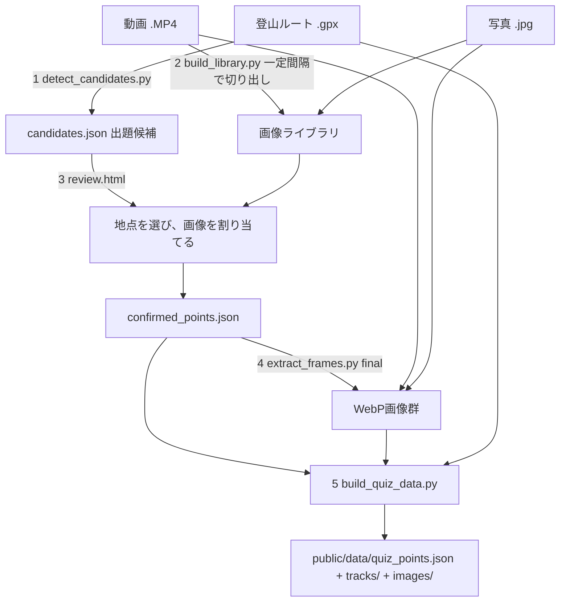

# 前処理パイプライン

動画→出題データ生成はすべて**ローカルPCで事前実行**し、確定した成果物（JSON・画像）だけを`public/`にコミットする。GitHub Pages（デプロイ先）はこのパイプラインを一切実行しない。



> **GPXの時刻は使わない。** 計画のGPXだと実際に歩いた時刻と無関係になりうるため、
> 撮影時刻から位置を割り出す方式は既定で使わない。**地点はGPXの形から、画像は人が選ぶ。**

## 1. `extract_telemetry.py`
DJI動画のdjmdトラック（`handler="CAM meta"`, protobuf）からフレーム毎のテレメトリを抽出し、CSV／JSON／サマリJSONを出力する。ffmpeg等の外部ツールに依存しない純Python実装。

```bash
python pipeline/extract_telemetry.py Source/DJI_xxx.MP4 \
  -o pipeline/data/telemetry.csv \
  --json pipeline/data/telemetry.json \
  --summary pipeline/data/telemetry_summary.json
```

### 出力フィールド
| 列 | 内容 |
|---|---|
| `frame_index` | フレーム番号 |
| `time_s` | 動画先頭からの秒（stts由来）。フレーム切り出しに使う |
| `capture_us` | カメラ内部時計の撮影タイムスタンプ [µs]。**実時間**の刻みを表す |
| `datetime_gps` | GPS由来の日時文字列。測位が切れると更新されない |
| `lat` / `lon` | WGS84（**生GPS**。正解座標には使わない） |
| `altitude_m` | 高度（元データはmm）。実データで国土地理院DEM 192.9mに対し199.69mと整合を確認 |
| `gps_acc_h_m` / `gps_acc_v_m` | GPS精度と推定される2値（水平/垂直, m）。精度の悪いサンプルの足切りに使う |
| `quat_w/x/y/z` | 姿勢クォータニオン（`heading_deg`の元） |
| `vec_x/y/z` | 3軸ベクトル（角速度 or 加速度と推定） |
| `iso` / `shutter_raw` | 露出関連（フレーム品質の参考） |

### 長尺・タイムラプス対応
本番は数時間・数GBのタイムラプスを想定しているため、

- ファイルは **mmap** で開き、サンプルは**ジェネレータで逐次処理**する（全読み込みしない）。CSV/JSONも逐次書き出す
- 4GB超で使われる **co64** チャンクオフセット、複数チャンクに分割された **stsc** に対応済み
- `capture_us`（実時間）と`time_s`（動画時間）の比から **`speed_factor`（タイムラプス倍率）** をサマリに出力し、1.5倍を超えたら`is_timelapse: true`とする

> **重要**：タイムラプスでは `time_s`（動画上の秒）と実時間が一致しない。GPXとの照合や候補検出は必ず`capture_us`由来の実時刻で行い、`time_s`はフレーム切り出しにだけ使う。

### GPSの健全性チェック
サマリJSONに`distinct_gps_fix_count` / `gps_frozen` / `distinct_datetime_count`を出し、異常時は警告を表示する。

> **検証済みの実データでの注意**：手元のテスト動画（Osmo Action 6, 13.7秒）では、GPS座標・GPS日時が**全411フレームで同一値のまま固定**されていた（`gps_frozen: true`）。かつGPS日時は撮影時刻より5時間以上前を指しており、記録開始前に取得した古い測位が使い回されている。**カメラのテレメトリGPSは位置の根拠として当てにできない**前提で設計し、位置はGPX側を正とする。

## 2. `match_gpx.py`
**このステップが出題の正確さを決める。**

```bash
python pipeline/match_gpx.py --gpx Source/route.gpx \
  --telemetry pipeline/data/telemetry.json \
  --out pipeline/data/track.json
# 分割された動画は --telemetry を複数回指定する（実時刻でマージされる）
```

照合方式は動画のGPSが生きているかで切り替える（`extract_telemetry.py`のサマリで判定する）。

| 方式 | 使う場面 | 内容 |
|---|---|---|
| **座標スナップ**（既定） | GPSが更新されている動画 | 各サンプルをGPXルート上の最近傍点（線分への垂線の足）にスナップ |
| **時刻照合** | `gps_frozen: true` / GPS無し | 動画の撮影開始時刻＋`capture_us`の経過から実時刻を求め、GPXのトラックポイントの時刻で位置を内挿する |

- 照合後座標を`lat`/`lon`、元座標を`raw_lat`/`raw_lon`、距離を`snap_distance_m`として保存する
- `snap_distance_m > 50m`（時刻照合では最寄りトラックポイントとの時間差 > 60秒）のサンプルには`suspect: true`と`suspect_reason`を付け、件数を警告表示する
- 動画とGPXの時計ずれは`--time-offset-s`で補正する
- ルート始点からの経路長`route_distance_m`を付ける（候補検出でピーク・コルを探すときの1次元座標になる）
- クォータニオンから`heading_deg`（カメラ方位、真北基準・時計回り）を算出する

### 出力（`track.json`）
```json
{
  "meta": { "mode_used": "time", "sample_count": 411, "suspect_count": 0,
            "heading": { "candidates": [...], "chosen": {"forward": "x", "world": "ned"} } },
  "samples": [ { "media_id": "...", "real_time": "...", "lat": 0, "lon": 0,
                 "raw_lat": 0, "raw_lon": 0, "snap_distance_m": 0,
                 "route_distance_m": 0, "suspect": false,
                 "heading_deg": 0, "heading_route_deg": 0 } ]
}
```

### heading_deg の座標系の当て方
DJIのクォータニオン規約は非公開なので、**前方軸（±x/±y/±z）×世界座標系（NED/ENU/NWU）の全18通りを直進区間で総当たり評価**し、進行方位との差が±20°以内に収まる割合が最も高い規約を採用する。80%に届く規約が1つも無ければ`heading_deg`を出力しない（誤った方位でモード②の初期視点を作らないため）。進行方位`heading_route_deg`は常に出力するので、そちらをフォールバックに使う。

### 複数メディア（分割動画・後から足す素材）
DJIは長時間撮影を複数ファイルに自動分割する。また運用上あとから写真や単発動画を足したくなる。そのため`match_gpx.py`は「実時刻を持つメディア」を任意個受け取り、実時刻で1本の時系列にマージする。各サンプルには`media_id`が付く。撮影開始時刻は ①`--start` ②サマリJSONの`source.start_local` ③ファイル名`DJI_YYYYMMDDHHMMSS_...` の順で決める。

**heading_degの座標系検証**：DJIのクォータニオン規約は公開されていないため、算出値を必ず検証する。GPS進行方位が安定している直進区間を抽出し、算出heading との差が±20°以内に収まるサンプルが80%以上あることを確認する。通らなければ軸の入れ替え・符号反転を試し、それでも駄目なら`heading_deg`を出力せずGPS進行方位で代用する。

## 3. `detect_candidates.py`
候補地点をタイプ別に自動抽出しスコア（確信度）を付ける。地形データは国土地理院DEM（標高タイル）を使用。

```bash
# 動画と照合済みのトラックから（切り出し時刻つきの候補になる）
python pipeline/detect_candidates.py --track pipeline/data/track.json \
  --video clip_a=Source/DJI_0001.MP4 --out pipeline/data/candidates.json

# GPXだけから（3Dビューのみで出題する地点）
python pipeline/detect_candidates.py --gpx Source/route.gpx \
  --out pipeline/data/candidates.json
```

ルートを一定間隔（既定10m）のノードに均し、各ノードの標高をDEMで埋めてから判定する。GPXの標高（気圧高度）よりDEMの方が一貫しているため、DEMが取れるならDEMを優先する。

| タイプ | 検出方法 | 主なしきい値 |
|---|---|---|
| `bend`（屈曲） | 前後60mの進行方位の変化が閾値を超え、かつ前後で極大になる点 | `--bend-min-deg` 既定30° |
| `peak`（ピーク） | ルート沿いの標高の極大点。左右で小さい方の高低差（プロミネンス）で足切り | `--peak-prominence-m` 既定15m |
| `col`（コル） | 同じく極小点 | `--col-prominence-m` 既定10m |
| `ridge_view`（展望） | 16方位に2kmまで視線を飛ばし、遮る地形の仰角が-2°未満（＝見下ろせる）方位の割合＝開放度 | `--view-min-openness` 既定0.3 |
| `ridge_start`（尾根に乗り始め） | 進行方向に直交する断面での盛り上がりが4m以上になり、それが150m以上続く地点 | 精度は低めで半自動前提 |

**重複の間引き**は2段階。①同じ種別で経路長が近いものをまとめ、②**実距離で近いものを種別をまたいで間引く**。②が無いと、往復・周回で同じ場所を2度通ったときに同一地点が2回出題されてしまう。種別がぶつかったときは、地形が特定しやすい `peak > col > ridge_start > ridge_view > bend` の順で残す。

**フレーム品質ゲート**（`--video` 指定時）：各候補の切り出し候補フレームについて、ブレ（ラプラシアン分散）と平均輝度を算出し、`low_quality: true`を付ける。アクションカメラのフレームは地面向き・ブレ・逆光が普通に混ざるため、これが無いと出題不能な画像が紛れ込む。

> ブレの絶対値はカメラ・画角・被写体で桁が変わる（**実測：Osmo Action 6 の4K実写で1500〜2500**、ぼかした合成映像で20前後）。そのため固定しきい値ではなく、**その動画自身のブレ値の中央値 × 0.35** と絶対最低ライン（60）の大きい方で判定する。

`suspect: true`（GPX乖離大・GPX時刻範囲外）由来の候補は既定で除外する。

すべて「候補」であり、最終採否は次のレビュー工程で人間が行う。

### 実データでの結果（大台ヶ原・日出ヶ岳 2026-06-11、8.7km / 標高差277m）
既定のしきい値で、生の検出167件 → 間引き後 **24件**（peak 4 / col 7 / ridge_start 3 / ridge_view 5 / bend 5）。日出ヶ岳の山頂（DEM 1692.9m）が`peak`として1回だけ拾われることを確認済み。処理時間は約3秒（DEMタイル16枚）。

### DEMタイルの扱い（`dem.py`）
`https://cyberjapandata.gsi.go.jp/xyz/{source}/{z}/{x}/{y}.txt`（256×256のCSV、単位m、欠測は`e`）を使う。既定は`dem`（DEM10B・10mメッシュ・z=14）、`--dem-source dem5a`で5mメッシュ（z=15、整備範囲のみ）。**取得したタイルは`pipeline/data/dem_cache/`に保存し、同じタイルを二度取りに行かない**（地理院タイルは大量アクセスの自粛が要請されている）。`--dem-offline`でキャッシュのみを使う（テストはこのモード）。

## 4. `review.html`（レビュー・手動追加ツール）
Leafletベースの単一HTMLファイル。`candidates.json`を読み込み、地形図上にタイプ別の色分けピンで表示する。`low_quality`の候補は視覚的に区別する。

- 候補ピンをクリック→採用/却下をトグル
- 採用候補の**切り出し時刻を±5秒・0.5秒刻みで調整**し、その時刻のフレームをプレビュー（ブレ・地面向きを避けるため。事前に低解像度プレビュー画像を一括生成しておく）
- 地図上の任意の場所をクリック→新規地点を手動追加（最も近いテレメトリ時刻を自動で紐づけ、タイプは`manual`）
- 「書き出し」ボタンで採用済み＋手動追加分を`confirmed_points.json`としてダウンロード

## 5. `extract_frames.py`
`confirmed_points.json`の確定時刻でffmpegからフレームを切り出す。

- 長辺1280pxのWebP、1枚200KB以下
- **メタデータを全除去**（`-map_metadata -1`）
- ファイル名は`{point_id}.webp`（緯度経度を含めない）

## 0. `studio.py`（ローカル専用UI・任意）

1〜6をブラウザから順に実行できる開発者用ツール。`Source/`のGPXと動画を選び、工程ごとに「実行」を押すとコマンドが走り、出力がそのまま画面に流れる。

```bash
python pipeline/studio.py          # http://127.0.0.1:8770
```

**127.0.0.1 にだけ待ち受ける**。GitHub Pagesに配信されるのは`public/`だけなので、このツールが公開されることはない。

動画が無くGPXだけで3D専用地点を作るときは、レビューを省いて候補を一括採用する近道も使える。

```bash
python pipeline/adopt_candidates.py --candidates pipeline/data/candidates.json \
  --mountain-id odaigahara-2026-06-11 --mountain-name "大台ヶ原・日出ヶ岳" \
  --out pipeline/data/confirmed_points.json
```

## 5b. `import_photos.py`（写真から地点を作る）

スマホで撮った写真をそのまま出題地点にする。動画の工程（1〜5）とは独立していて、**GPXと写真だけあれば動く**。

```bash
python pipeline/import_photos.py --gpx Source/route.gpx \
  --photos-dir Source/photos \
  --mountain-id odaigahara-2026-06-11 --mountain-name "大台ヶ原・日出ヶ岳" \
  --out pipeline/data/confirmed_points.json --images-out pipeline/data/frames
```

- 位置は **EXIFの撮影日時をGPXに突き合わせて** 決める。写真のGPSは使わない（GPXの方が精度も一貫性も高い。設計判断は[spec.md](spec.md)）
- EXIFにUTCオフセットが無ければ`--tz`（既定 +09:00）を使う。カメラの時計がずれていれば`--time-offset-s`で補正する
- GPXの時刻範囲から300秒以上外れた写真は**採用せず理由を出す**（別の山行の写真が紛れても違う場所の地点を作らない）
- 画像は長辺1280pxのWebP・200KB以下・メタデータ全除去。ファイル名は`{point_id}.webp`
- **HEIC/HEIFは読めない**。iPhoneの写真はJPEGに変換してから置く
- EXIFの読み取りは`pipeline/exif.py`。撮影日時・UTCオフセット・GPS・向きだけを読む最小実装で、画像ライブラリには依存しない

## 6. `build_quiz_data.py`
- `confirmed_points.json`をMountain/Point構造（[data-model.md](data-model.md)参照）に変換。**公開JSONに出すのはスナップ後座標のみ**（生GPS・snap_distance・品質スコアは中間ファイルに留める）
- **GPXを許容誤差8mで間引き、`public/data/tracks/{mountain_id}.json`に書き出す**（地形図に重ねて描くルート。実績：425点→100点 / 2.6KB）。`Mountain.track_path`から参照する
- `max_distance_m` = GPXルートのバウンディングボックス対角線長 × 0.5（厳しめ、係数は引数で調整可能）
- `dataset_version`（生成日時ISO文字列）を付与
- 画像を`public/images/`、JSONを`public/data/quiz_points.json`にコピー・生成
- 既存の`quiz_points.json`がある場合は`mountain_id`単位でマージ
- 参照画像が存在しないPointがあればエラー終了

## 複数山への拡張
新しい山ごとに1〜6を独立に実行し、6の最後で既存`quiz_points.json`にマージする。id は`{山のslug}-{日付}-{連番}`で衝突を避ける。

## コミットしないもの
`Source/`（動画）、`*.gpx`の原本、`pipeline/data/`（中間生成物・プレビュー画像）は`.gitignore`対象。リポジトリに入るのは`public/data/quiz_points.json`と`public/images/`の確定成果物のみ。
