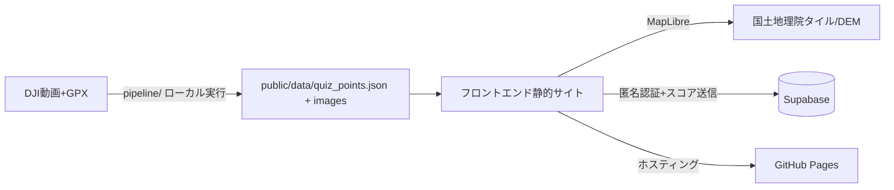
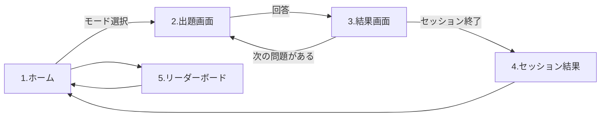

# YamaGuessr 仕様書

> **ステータス**: 作成中 ・ **作成日**: 2026-07-29 ・ **最終更新**: 2026-07-29（初回レビュー反映）
> **読者**: 実装するエージェント（必要に応じて人間）。背景は [../README.md](../README.md)、作業規約は [../AGENTS.md](../AGENTS.md)、他の設計は [README.md](README.md)（docsの索引）。

実装の**契約書**。各機能の「受け入れ条件」が合格ラインで、AGENTS.mdの検証ループで照合する。仕様を変えたら同期規約に従いこのファイルと関連docsを更新する。

---

## 1. 概要

- **一言コンセプト**: DJIアクションカメラの登山動画から作る、GeoGuessrの登山版
- **ターゲット**: 自分（開発者）と、リンクを知る友人・知人。不特定多数への大規模公開は想定しない

> 詳しい背景は ../README.md（重複させない）。

### 前提となる設計判断（実装前に必ず理解する）

| 判断 | 内容 | 理由 |
|---|---|---|
| 正解座標はGPXの**形**から決める | Pointのlat/lonは、GPXルートの形と地形（DEM）から自動検出した候補地点の座標 | テレメトリGPSは実測で**全フレーム同じ値で固定**される事例があり、位置の根拠にできない |
| **GPXの時刻は使わない** | 撮影時刻からGPXを引いて位置を決める方式は既定で使わない（`--mode time` の明示が要る） | GPXが「計画」であることがあり、実際に歩いた時刻とは無関係になりうる。時刻を信じると位置がまったく合わない |
| **画像は人が地点に割り当てる** | 動画も写真も「ただの画像」として一覧化し、どの画像をどの地点に使うかは`review.html`で人が選ぶ。1地点に複数枚可 | 位置を自動で当てる根拠が無い以上、人が見て「この地点から見た画」を選ぶのが唯一確実。動画は画像の供給源として扱う |
| 画像の無い出題地点を許す | `Point.image_path`は任意。画像が無い地点は**モード②（3D地形）専用**として出題する | 動画のフレームが足りない／使える画になっていない地点でも、GPXとDEMさえあれば「この地形はどこか」という問題は成立する。動画の量に出題数を縛られない |
| モード②の3Dはテクスチャなし | 陰影起伏（hillshade）または単色標高ランプのみ。地形図タイルを地形に貼らない | 地形図テクスチャには山名・三角点・注記が焼き込まれており、答えが画面に表示されてしまう |
| **モード②は一人称に固定** | カメラを地面＋目線1.5mに置き、俯瞰はできない。ルートの上は前後に歩ける（ストリートビュー式） | 上空から見下ろす画では「自分がどこに立っているか」が伝わらず、地形図と突き合わせる手がかりにならない。実際に山で見た画に近いほど、当てる作業が登山の記憶とつながる |
| **3Dにはルート全体を描く** | 「足元の前後10mだけ」から改めた | ルートの上を歩けるようにした以上、進める先が見えないと移動の操作にならない。一人称なので尾根の裏は地形に隠れて見えず、回答用の2D地形図には既に全体を描いているので、これで答えが増えるわけではない |
| 答えはクライアントにある | 静的サイトのためquiz_points.jsonに全正解が含まれる。難読化はしない | 難読化しても静的配信である以上突破される。友人内の名誉制で運用し、リーダーボードは「参考記録」と位置づける |
| 前処理は常にローカル | 動画・GPX・中間生成物はリポジトリに入れない | GitHub Pagesは静的配信のみ。容量・帯域の予算も守る |

## 2. 機能一覧

### ✅ MVP

#### 機能A-1：テレメトリ抽出（`pipeline/extract_telemetry.py`）
- [x] DJI動画パスを渡すと、フレーム毎の`frame_index`/`time_s`/`capture_us`/`lat`/`lon`/`altitude_m`/`quat_*`等を含むCSVとJSONを出力する
- [x] 数時間・数GBの動画でも全サンプルをメモリに載せずに処理できる（mmap＋逐次書き出し。3万フレームの合成データで検証）
- [x] 4GB超動画で使われる`co64`、複数チャンクに分割された`stsc`を正しく読める
- [x] サマリJSONに`speed_factor`（実時間 ÷ 動画時間）を出力し、1.5倍超なら`is_timelapse: true`とする
- [x] GPS座標が全フレーム同一（測位が更新されていない）場合に`gps_frozen: true`を立て、警告を表示する
- [x] djmdトラックが無い動画では明示的なエラーで終了する

#### 機能A-2：ルート照合（`pipeline/match_gpx.py`）
- [x] 複数のテレメトリ（＝分割された複数動画）を一度に渡せ、出力の各サンプルがどのメディア由来かを`media_id`で識別できる
- [x] 各サンプルに撮影実時刻（`real_time`, ISO8601）が付き、メディアを跨いでも時系列順に並ぶ
- [x] 各テレメトリサンプルをGPXルート上の最近傍点にスナップし、スナップ後座標・元座標・`snap_distance_m`を含むtrack JSONを出力する
- [x] `snap_distance_m`が閾値（既定50m）を超えるサンプルには`suspect: true`が付き、件数がコンソールに警告表示される
- [x] `gps_frozen: true`（またはGPS無し）の動画では、座標スナップではなく**実時刻での照合**に切り替わる。動画の撮影開始時刻＋`capture_us`の経過からGPXトラックポイントを内挿し、時計ずれを補正する`--time-offset-s`を持つ
- [x] タイムラプス動画（`speed_factor > 1`）でも、`time_s`ではなく`capture_us`由来の実時刻でGPXと照合する
- [x] GPXの時刻範囲外のサンプル（撮り始め・撮り終わりのはみ出し）に`suspect: true`が付く
- [x] `heading_deg`（クォータニオン由来のカメラ方位）を算出する。前方軸×世界座標系の全組み合わせを直進区間で自動評価し、**一致率80%以上の規約が無ければ`heading_deg`を出力しない**（誤った方位を配らない）。代わりに進行方位`heading_route_deg`を常に出力し、モード②の初期視点のフォールバックにする
- [ ] **実データでの検証**：本物のGPXと本番動画が揃った時点で、直進区間での一致率が80%以上になる規約が存在することを確認する（合成データでは検出ロジック自体は検証済み）

#### 機能B：候補検出
- [x] `pipeline/detect_candidates.py`を実行すると、`bend`/`ridge_view`/`ridge_start`/`peak`/`col`の5種でタグ付けされた候補地点リストが、各点lat/lon/type/score/route_distance_m/elevation_mを含むJSONで出力される
- [x] 動画と照合済みの`track.json`を渡した場合は、各候補に`frame_time_s`と`media_id`が付く
- [x] **GPXだけでも実行でき**、その場合は`has_frame: false`の候補になる（3Dビューのみで出題する地点）
- [x] `ridge_view`/`ridge_start`は国土地理院DEMの地形から判定し、タイルはローカルにキャッシュして再取得しない
- [x] 各候補について切り出し候補フレームの品質指標（ブレ=ラプラシアン分散、平均輝度）を算出し、閾値未満のフレームには`low_quality: true`が付く。**ブレの絶対値はカメラで桁が変わるため、その動画自身の中央値に対する相対しきい値と絶対最低ラインの大きい方で判定する**
- [x] `suspect: true`（GPX乖離大／時刻範囲外）のサンプル由来の候補は既定で除外される
- [x] **往復・周回で同じ場所を2度通っても、同一地点が重複して候補にならない**（実距離での間引き。同じ景色が2回出題されるのを防ぐ）
- [x] 同じ場所で種別がぶつかったときは、地形が特定しやすい種別を優先する（peak > col > ridge_start > ridge_view > bend）

#### 機能O：出題データ追加のローカルUI（`pipeline/studio.py`）
> **開発者のローカル実行専用。** GitHub Pages に配信されるのは`public/`だけなので、このツールは公開されない。

- [x] `python pipeline/studio.py` で起動し、ブラウザから前処理を順に実行できる
- [x] `Source/` に置いたGPXと動画を一覧表示し、選んで使える
- [x] **GPX・写真・動画を画面から追加できる**（`Source/` と `Source/photos/` に置かれる。同名は上書きせず連番）
- [x] 写真取り込み／テレメトリ抽出／GPX照合／候補検出／プレビュー生成／レビュー起動／画像切り出し／出題データ生成 を画面から実行できる
- [x] アップロードのファイル名からパス区切りを落とし、置き場の外に書けない
- [x] 実行中のコマンドの出力がそのまま画面に流れる（失敗したら終了コードが出る）
- [x] いま公開されている山の一覧（地点数・max_distance・ルートの有無）と、中間データの有無が見える
- [x] **127.0.0.1 にだけ待ち受け**、他の端末からは接続できない
- [x] レビューを省いて候補を一括採用する近道（`pipeline/adopt_candidates.py`）がある。動画が無く3D専用地点だけ作るときに使う

#### 機能C：レビュー・画像割り当てツール（`pipeline/review.html`）
- [x] `candidates.json`を読み込むと、地図上に候補地点が種別ごとに色分けされたピンで表示される
- [x] `library/index.json`を読み込むと、動画から切り出した画像と写真が一覧で並ぶ
- [x] 地点を選んでから画像をクリックすると、**その地点に画像が割り当てられる**。もう一度押すと外れる。1地点に何枚でも割り当てられる
- [x] 画像を割り当てた地点はピンの枠が太くなり、地図上で見分けられる
- [x] 画像一覧は「すべて／未使用のみ／動画から／写真」で絞り込める。他の地点で使った画像は薄く表示される
- [x] 候補ピンの採用/却下をトグルできる（キーボードの A / R でも操作できる）
- [x] 地図上の任意地点を Shift+クリックすると新規地点を手動追加できる
- [x] 「書き出し」操作で、採用済み地点が**割り当てた画像の情報付き**で`confirmed_points.json`としてダウンロードされる
- [x] 地図は地理院タイルを使い、出典表示を常時出す

#### 機能Q：画像ライブラリ（`pipeline/build_library.py`）
- [x] 動画を一定間隔（既定2秒）で切り出し、閲覧用のJPEGにする
- [x] `Source/photos/` の写真を同じ一覧に取り込む。EXIFの撮影日時が読めれば並び順に使う
- [x] 動画と写真を混ぜても画像IDが衝突しない
- [x] 作り直すと前回の残りが混ざらない
- [x] HEIC/HEIFは読めない旨を報告する（JPEGへの変換を促す）
- [x] **位置は一切推定しない**。どの地点に使うかはレビューで人が決める

#### 機能D：出題用画像・出題データ生成
- [x] `pipeline/extract_frames.py final`が、割り当てられた画像を**原本から**作り直す（動画フレームは動画から、写真は写真から）。長辺1280pxのWebP・1枚200KB以下・**メタデータ全除去**（`-map_metadata -1`）。上限に収まらなければ品質を段階的に落とす
- [x] 出力画像のファイル名に緯度経度が含まれない（`{point_id}-{連番}.webp`形式）
- [x] 一部の画像が作れなくても、作れたぶんは書き出し、失敗した内容を報告する
- [x] `pipeline/build_quiz_data.py`実行後、`public/data/quiz_points.json`が[data-model.md](data-model.md)のスキーマに一致し、`dataset_version`（生成日時ベースの文字列）が含まれる
- [x] 生GPS・`snap_distance_m`・品質スコア・**画像の出所（動画名や切り出し秒）**などの中間情報が公開JSONに出ない
- [x] 参照画像が存在しないpointがある場合、エラー終了して該当idを表示する
- [x] 既存のquiz_points.jsonがある状態で新しいmountainを追加実行すると、既存データを壊さずマージされ`dataset_version`が更新される

#### 機能E：スコアリング
- [x] `build_quiz_data.py`が各mountainの`max_distance_m`を「GPXルートのバウンディングボックス対角線 × 0.5」で算出する（厳しめ設定、係数は`--max-distance-factor`で調整可能。下限200m）
- [x] `src/scoring.ts`が次式でスコアを返す（`k`=`Mountain.scoring_k`、既定4）：
  `d >= max` のとき `0`、それ以外は `round(5000 * (exp(-k*d/max) - exp(-k)) / (1 - exp(-k)))`
- [x] ユニットテストが通る：`d=0`→5000点、`d=max`→0点、`d>max`→0点、および距離に対して単調非増加であること
- [x] （不連続点が無いことの確認）`d = max - 1m` のスコアが10点未満である
- [x] 参考カーブ（k=4）の各点が実装値と一致する（0.05→4077 … 1.0→0）

> 参考カーブ（k=4、検算済み）：d/max = 0.05→4077点、0.1→3321点、0.2→2195点、0.3→1441点、0.5→596点、0.75→160点、1.0→0点

#### 機能N：コース（GPXトラック）の表示と選択
- [x] 回答用の地形図に、その山のGPXトラックが重ねて描かれる（白いハローを敷いた朱線）
- [x] トラックは山ごとの別ファイル（`public/data/tracks/{mountain_id}.json`）で、遊ぶ山のぶんだけ読み込む
- [x] GPXは許容誤差8mで間引いて配信する（実績：425点→100点 / 2.6KB）
- [x] ホーム画面で**どのコースから出題するかを選べる**。山が2つ以上あるときは「すべてのコース」も選べる
- [x] 選択中のコースと、そのコース×手がかりで出題できる地点数が表示される（0件のときは選べない）
- [x] トラックの読み込みに失敗しても出題は続けられる（ルートが描かれないだけ）

> 出題は「このルートのどこか」を当てる一次元の問題になる。ルートを見せないと手がかりが少なすぎて当てずっぽうになるため、既定で表示する。難易度を上げたくなったら表示のON/OFFを設定に足す（未決定事項）。

#### 機能F：モード①（地形図当て）
- [x] 出題開始時に、その地点に割り当てられた画像が表示される
- [x] **1地点に複数の画像がある場合はサムネイルで切り替えられる**
- [x] 画像を持たない地点はモード①の出題対象に含まれない（モード②専用）
- [x] 国土地理院地形図（MapLibre）が表示され、クリックした座標が推測地点として記録される
- [x] 未選択の状態では「回答する」が押せない
- [x] 「回答する」を押すと、正解地点・推測地点・両者を結ぶ線・距離(m)・獲得スコアが表示される
- [x] 地図上に地理院タイルの出典表示（「地理院タイル」＋出典URLへのリンク）が常時表示される
- [x] **初期表示は正解地点を中心にしない**。山ごとに固定の範囲を出すので、画面中央が答えにならない（`src/data.ts` の `mountainView`）
- [x] 距離リング（100m/250m/500m/1km/2km/5km）を等高線と同じ細線で描き、推測方向にラベルを並べる（DESIGN.md のシグネチャ）

#### 機能G：モード②（3D地形当て）
- [x] フレーム画像と、当該地点周辺のMapLibre 3D地形（GSI DEM由来）が同時に表示される
- [x] **`image_path`を持たない地点では、3D地形だけで出題される**（画像枠は表示しない）。モード①の対象からは除外される
- [x] 3D地形は**陰影起伏のみ**で描画され、地名・注記・等高線ラベルを含む地形図タイルを地形テクスチャに使用していない
- [x] **カメラは地面＋目線の高さ（1.5m）に立つ**。地形の標高から毎回計算するので、坂の途中でも地面に潜らず、浮きもしない
- [x] **俯瞰にならない**。見下ろし角には上限（既定24度、地形の都合で下げるときも45度まで）があり、上空から見下ろす画にはならない
- [x] **ドラッグで360度ぐるりと見回せる**（矢印キー左右でも可）。回しても立ち位置は変わらない
- [x] **ルートの上を前後に歩ける**（ストリートビューと同じ操作感）。「進む」は**今向いている方向**へ25m、矢印キー上下も同じ。Shift併用で100m
- [x] **ルート（朱線）をタップするとその場所へ移動する**。ルートから遠い場所をタップしたときは移動せず、その旨を知らせる
- [x] 「出発地点」で出題地点に戻れる。歩いた距離が1m以上のときだけ押せる
- [x] **回答の正解は出発地点**。歩いている間は「出発地点から○m」を常時表示し、離れていることが分かる
- [x] 15m以上離れると出発地点に印が出る（足元にあるうちは邪魔なので出さない）
- [x] **GPXルート全体**が3D地形の上に描かれる。一人称なので尾根の裏に回った部分は地形に隠れて見えない
- [x] 画面に「この地点／今ここ」「方位（○°／北向き等）」「標高」が常時表示される
- [x] 標高タイルが届く前は出題データの`elevation_m`を使い、届いたら視点を解き直す（読み込み中も一人称のまま）
- [x] ルートが登録されていない山では移動ボタンが押せない（その場から見回すだけ）
- [x] 初期カメラ方位が`Point.heading_deg`に設定される。無い地点は`heading_route_deg`（進行方位）で代用する
- [x] 3Dビューとは別に2D地形図（機能Fと共通コンポーネント）でクリックして座標を回答する
- [x] 回答後、正解地点・距離・スコアが表示される
- [x] 地理院の標高タイル（独自エンコード）を`maplibregl.addProtocol`でterrain-RGBに変換し、外部ライブラリを足さずに3D化している

#### 機能H：10問チャレンジモード
- [x] 開始時にモード①/②のいずれかを選択できる
- [x] 全pointsからランダムに重複無し10問（総数が10未満の場合は全問）が出題される
- [x] 10問終了後、合計スコアと各問のスコア内訳一覧が表示される

#### 機能I：全地点制覇モード
- [x] 現在登録されている全pointが1問ずつ出題される
- [x] 進捗（何問中何問終えたか、どのpointが未回答か）がlocalStorageに保存され、ページ再読み込み後も再開できる
- [x] 保存された進捗の`dataset_version`が現在のデータと異なる場合、その旨を通知して進捗をリセットするか続行するか選べる
- [x] 全問終了後、合計スコア・**達成率（合計 ÷ 5000×出題数、%表示）**・踏破達成メッセージが表示される

#### 機能J：サウンド演出
- [x] 回答後、獲得スコアが4000点以上なら正解音、それ未満なら別の効果音が再生される
- [x] 10問チャレンジ・全地点制覇の完了時に、専用の終了音が再生される
- [x] サウンドON/OFFトグルがあり、OFF時はいかなる効果音も再生されない。設定はlocalStorageに保存され次回起動時も維持される
- [x] 音源は**Web Audio APIで実行時に合成する自作音**でファイルを持たない。出典は`public/sounds/CREDITS.md`に記載

#### 機能K：Supabase匿名認証・ニックネーム
- [x] 初回アクセス時にニックネーム入力ダイアログが表示され、入力するとSupabase匿名認証でユーザーが作成され`players`テーブルにニックネームが保存される
- [x] 2回目以降のアクセスでは、端末に保存されたSupabaseセッションから自動的に同一プレイヤーとして認識され、ニックネーム入力を求められない
- [x] ヘッダーのニックネームボタンから変更でき、`players`テーブルが更新される
- [x] **Supabaseに接続できない場合でも、ゲーム本体（出題・回答・スコア計算）は最後まで動作する**（ニックネームは「ゲスト」扱い、リーダーボード関連UIのみ非表示）
- [ ] **実キーでの疎通確認**（環境変数未設定のため未実施。キー受領後に確認する）

#### 機能L：リーダーボード
- [x] セッション完了時、`mode`・`view_mode`・`points`・`point_count`・`dataset_version`を含むレコードが`scores`にinsertされる
- [x] リーダーボードは`mode` × `view_mode`の組み合わせごとに切り替えて表示でき、各上位20件が並ぶ
- [x] `complete_all`のランキングは**達成率(%)降順**で並び、生スコアではない（地点数が増えても過去記録と比較できるため）
- [x] スコア送信に失敗した場合、通知したうえでリザルト画面自体は正常に表示される（結果が消えない）
- [x] 上限を超える点数（`points > 5000 × point_count`）のinsertがDB側のCHECK制約で拒否される（`supabase/schema.sql`）
- [ ] **実キーでの疎通確認・RLS/CHECK制約の実挙動確認**（キー受領後に実施）

#### 機能M：モバイル対応
- [x] 375px幅（iPhone SE相当）でレイアウト崩れなく主要操作（画像確認・地図クリック・回答）ができる。横スクロールが出ないことを実測で確認
- [x] 地図・3Dビューのパン／ズーム／回転がタッチジェスチャーで操作できる（回答用2Dは誤操作防止のため回転を無効化）
- [x] タップ可能なUI要素のタップ領域が44px四方以上ある（MapLibre既定の29pxボタンもCSSで44pxに拡大）
- [x] 入力欄のフォントは16px以上（iOSの自動ズーム回避）
- [x] ポインタが使えなくても、地図にフォーカスして Enter で画面中央に推測地点を置ける

#### 機能P：写真から出題地点を作る（`pipeline/import_photos.py`）→ **廃止**
EXIFの撮影日時をGPXに突き合わせて写真の位置を決める機能だったが、**GPXの時刻を位置の根拠にしない**方針（上の設計判断表）に反するため削除した。間違った位置の地点を作る道具を残さない。写真は機能Q（画像ライブラリ）経由で取り込み、どの地点の画像かは人が割り当てる。EXIFの読み取り（`pipeline/exif.py`）は写真の並び順にだけ使う。

### 🔜 Phase 2
- [ ] HEIC/HEIFの直接読み込み（今はJPEGへの変換が要る）
- [ ] 難易度フィルタ（種類別: peakのみ、col含む、等）
- [ ] SNS共有用のリザルト画像生成
- [ ] 不正スコア対策の強化（Supabase Edge Functionでのサーバ側スコア再計算）

### ❌ スコープ外
- サイト上での動画アップロード・処理（前処理は常にローカルPC実行）
- 本格的なユーザー認証（メール/パスワード等）
- 正解データの秘匿・難読化（静的サイトでは実現不能。名誉制で運用）
- 不特定多数への大規模公開・広告

## 3. 構造（データ・画面・API・構成）

| 種類 | 置き場所 |
|---|---|
| データモデル | [data-model.md](data-model.md) |
| 前処理パイプライン | [pipeline.md](pipeline.md) |
| デプロイ・運用 | [operations.md](operations.md) |
| 画面・遷移 | 下にinline（画面数が少なく単純なため） |

### 全体構成

### 画面 / 遷移
| # | 画面 | 概要 |
|---|---|---|
| 1 | ホーム | ニックネーム表示、モード選択（10問チャレンジ／全地点制覇 × ①/②）、サウンドON/OFF |
| 2 | 出題画面（①/②共通レイアウト） | フレーム画像＋（モード②のみ3Dビュー）＋回答用2D地形図 |
| 3 | 結果画面（1問） | 正解地点・推測地点・距離・スコア表示、「次へ」 |
| 4 | セッション結果画面 | 合計スコア・達成率・内訳、スコア送信結果 |
| 5 | リーダーボード | mode × view_mode 別ランキング |

## 4. 非機能要件

| 項目 | 要件 |
|---|---|
| 性能 | quiz_points.jsonは初回ロード後キャッシュ、フレーム画像は出題直前に遅延読込 |
| 容量 | 画像は長辺1280px・WebP・1枚200KB以下。リポジトリ全体の目安200MB以内（GitHub Pagesの制限内） |
| 外部サービス依存 | 国土地理院タイル：出典表示必須、大量アクセスを行わない。Supabase：障害時もゲーム本体は動作する |
| セキュリティ | anon keyは公開前提。書き込みはRLSで`auth.uid() = player_id`のみ、点数はCHECK制約で上限を制限。service_role keyはフロントに置かない |
| 正解データの秘匿性 | **秘匿しない**（静的サイトのため不可能）。リーダーボードは名誉制の参考記録である旨をUIに明記 |
| 対応環境 | 最新Chrome / Safari（PC・モバイル） |

## 5. 検証戦略

### 受け入れ条件 → 検証方法
| 受け入れ条件 | 検証方法 | 自動 / 手動 |
|---|---|---|
| テレメトリ抽出・GPXスナップ・候補検出のJSON形式 | `pytest pipeline/`（合成データ＋実動画fixtureでの単体テスト） | 自動 |
| heading_degの座標系（進行方位との一致率80%） | `pytest pipeline/tests/test_match_gpx.py`（規約の総当たり評価と、合わない場合に出力しないこと） | 自動 |
| 出題開始時に答えが画面中央に来ない | `npm test`（`session.test.ts` の `mountainView`） | 自動 |
| 効果音OFF時に音を鳴らさない | `npm test`（`sound.test.ts`、AudioContextのモックで検証） | 自動 |
| 375px幅で横スクロールが出ない／タップ領域44px | 開発サーバをその幅で開き、DOMを実測 | 手動 |
| レビューツールの採用/却下・時刻調整・手動追加 | `pipeline/review.html`をブラウザで開き操作 | 手動 |
| 画像のメタデータ除去・サイズ上限 | `pytest pipeline/test_extract_frames.py`（出力ファイルを検査） | 自動 |
| quiz_points.jsonのスキーマ一致・マージ | `pytest pipeline/test_build_quiz_data.py` | 自動 |
| スコア計算式（境界・単調性・連続性） | `npm test`（`scoring.test.ts`） | 自動 |
| モード①②の回答フロー | 開発サーバで実際に1問解いて目視確認 | 手動 |
| モード②の3Dに地名注記が写り込まない | 3Dビューを一周見回して目視確認 | 手動 |
| 地理院タイルの出典表示 | 両モードの画面で表示を目視確認 | 手動 |
| 全地点制覇の進捗保存・dataset_version不一致時の挙動 | 再読み込み・データ差し替えで手動確認 | 手動 |
| Supabase障害耐性 | ネットワークをブロックした状態で1セッション完走できるか手動確認 | 手動 |
| RLS・CHECK制約 | 他人のplayer_idでのinsert、および上限超過スコアのinsertが拒否されることを確認 | 手動 |
| モバイルレイアウト | Chrome DevToolsのデバイスエミュレーション（375px）で目視確認 | 手動 |

> 実行コマンドはAGENTS.mdの検証ループに一元化（ここで再掲しない）。

### 完了の定義（DoD）
- [ ] 紐づく受け入れ条件がすべて○ ／ 自動テスト・Lint・型・ビルドgreen
- [ ] 手動確認を実施済み
- [ ] 変更に対応するdocs（spec・data-model・pipeline・operations・必要ならREADME）を更新済み

> 1つでも未達なら未完了。完了宣言せず修正して再検証。

## 6. 実装タスク

各機能は**実装→検証→○になるまで修正してから次へ**（AGENTS.mdの検証ループ）。

- [x] セットアップ（Vite+TS雛形、vitest/eslint、pipeline/のPython雛形+pytest、GitHub Actions）※Supabaseプロジェクト作成は未
- [x] 機能A-1：テレメトリ抽出（長尺・タイムラプス対応）→ `pytest pipeline/` green
- [x] 機能A-2：GPXスナップ／時刻照合・heading算出 → `pytest pipeline/` green（実データでのheading検証のみ本番動画待ち）
- [x] 機能B：候補検出＋品質ゲート（DEM連携込み）→ `pytest pipeline/` green＋実GPX（大台ヶ原）で目視確認
- [x] 機能C：レビュー・時刻調整・手動追加ツール → 実candidates.json（大台ヶ原24件）をブラウザで操作して確認
- [x] 機能D：フレーム抽出・quiz_points.json生成 → `pytest pipeline/` green＋実動画で1枚切り出して検査
- [x] 機能E：スコアリング（`src/scoring.ts`＋ユニットテスト）→ `npm test` green
- [x] 機能F：モード①（地形図当て） → 実データで通しプレイして確認
- [x] 機能G：モード②（3D地形当て） → 実データで通しプレイして確認
- [x] 機能H：10問チャレンジモード → 10問通して結果画面まで確認
- [x] 機能I：全地点制覇モード → 中断・再開・版不一致の3経路を確認
- [x] 機能J：サウンド演出 → `npm test`（オフ時に音源を作らないことを検証）
- [x] 機能K：Supabase匿名認証・ニックネーム（障害耐性込み）→ 実装済み。**キー未設定の状態で1セッション完走できることを確認**（＝障害耐性の受け入れ条件）
- [x] 機能L：リーダーボード → 実装済み。実キーでの疎通のみ未実施
- [x] 機能M：モバイル対応の仕上げ調整 → 375pxで横スクロール0・タップ領域44px以上を実測
- [x] 機能N：GPXトラックの配信・地形図への描画・コース選択UI → `npm test` green＋実データで目視確認
- [x] 機能G改：3Dビューを一人称360度に作り直し → 実データで見回して目視確認
- [x] 機能O：出題データ追加のローカルUI → `pytest pipeline/` green＋実際に起動して2工程を実行確認
- [x] 機能G改2：3Dをストリートビュー式（目線1.5m・ルート上を移動・俯瞰なし）に作り直し → `npm test` green＋実データで12方位の視点を実測（pitch 80〜84.5・カメラ位置の誤差0m）し、歩く／タップ移動／出発地点復帰を目視確認
- [x] localhostのときだけホームにstudioへの導線を出す → ローカルで表示・`http://127.0.0.1:8770/` の応答を確認
- [ ] 仕上げ：**本番動画とSupabaseキーの受領後**に、実データでの通し再検証（heading規約の確定・時計ずれの較正・実キーでのRLS/CHECK確認）

## 7. 未決定事項 / 要確認

### 🔴 実データ待ち
- [ ] **本番のタイムラプス動画でカメラのGPSが更新されているか**。手元のテスト動画では固定値だった（下記）。実際のタイムラプスで1件でも座標が動いていれば座標スナップ方式も併用できる。動画は2026-07-30に提供予定
- [ ] **動画とGPXの時計ずれ**。時刻照合の精度を決めるので、実動画が来たら既知地点（山頂通過など）で`--time-offset-s`を較正する
- [ ] 大台ヶ原のGPXは往復・周回を含み、**同じ場所を2度通る**。既に実距離での間引きを入れたが、出題時に「見覚えのある景色」が続かないか実際に遊んで確認する

### ✅ 確認済み
- [x] **GPXログは用意できる**（ヤマレコ／YAMAP等からエクスポート）。位置の根拠はGPXを正とする
- [x] **YAMAPのGPXにはトラックポイントごとの時刻と標高が入っている**（大台ヶ原・日出ヶ岳・大杉谷 2026-06-11 で確認：425点／中央値24秒・20m間隔／全長8.7km／標高1416〜1694m）。時刻照合方式が使える
- [x] **動画が足りない地点は3Dビューのみで出題する**方針を採用。`Point.image_path`を任意にし、`detect_candidates.py`はGPXだけでも候補を出せるようにした
- [x] **撮影は短時間だが、1つの山が複数の動画ファイルに分割されうる**。→ 1山＝複数メディアを前提に設計する（下記「メディア入力の一般化」）
- [x] **後から写真や単発動画を追加したい**という要望あり。→ 入力を「動画」に限定せず、時刻を持つメディア一般として扱う

### ✅ 実測で解決済み
- [x] ~~`aux1`/`aux2`の意味~~ → **`aux1`=GPS水平精度[m]、`aux2`=GPS垂直精度[m]** と推定（実測値 4.6 / 12.1）。同ブロックの整数値は**高度[mm]**で、国土地理院DEMの192.9mに対し199.69mと数m差で整合。`altitude_m`として抽出するが、公開JSONには引き続き含めない
- [x] ~~フレーム毎の実時刻の取り方~~ → djmdに**撮影タイムスタンプ[µs]**（`capture_us`）が入っている。タイムラプス倍率はここから算出できる

### 🟡 継続課題
- [ ] **ルートを常に表示する前提での難易度**。当てる問題が「ルート上のどこか」の一次元になったぶん易しくなった。`max_distance_m`の係数0.5とk=4は、この前提で遊んでみて調整する。難しくしたければルート表示のON/OFFを設定に足す
- [ ] 3Dビューは MapLibre の上限（pitch 85度）があるため、**視線の中心は必ず水平より5.5度下**になる。画角の上半分には水平線と遠くの尾根が入るので実用上は足りているが、近くの山を見上げたい場面が出たら別の描画方法を検討する
- [ ] 3Dビューにズーム（遠くの尾根を引き寄せる）が無い。MapLibre に画角を変える公開APIが無いため見送った。ズーム値は「見ている先までの距離」から自動で決まる
- [ ] 3Dの地形は10mメッシュのDEMなので、**目の前20mほどには見るべき起伏が無い**。上り斜面を向くと画面の大半が単調な面になる。影側でも面が読めるよう陰影の暗部を持ち上げてあるが、それ以上は元データの限界
- [ ] 数m先の急斜面を向くとズーム上限（21）に当たり、カメラが視線の後ろへ十数m下がる（MapLibreの近クリップ面が約6mあるため）。採点は出発地点基準なので影響は無いが、厳密には立ち位置とずれる
- [ ] **テレメトリGPSが固定値のまま更新されない事例を確認**（Osmo Action 6, FW 10.00.34.29）。13.7秒411フレームすべてで同一座標・同一日時、しかもその日時は撮影時刻の5時間以上前。原因（測位ロスト／記録開始時の値の固定）は未特定。GPXとの時刻照合を主経路として設計する
- [ ] DJIクォータニオンの座標系規約が不明。機能A-2の検証（進行方位との一致率）が通らない場合、軸の入れ替え・符号反転を試す。それでも通らなければ`heading_deg`を諦め、モード②の初期方位はGPS進行方位で代用する
- [ ] タイムラプスの1フレームあたり実時間が長い（例：2秒）場合、GPX内挿の誤差がどこまで許容できるか。`max_distance_m`との兼ね合いで実データを見て判断する
- [ ] `ridge_start`（尾根に乗り始めた場所）の自動検出は精度が低い見込み。初期リリースでは半自動レビューでの人間判断に強く依存する
- [ ] GPXが無い動画・山の扱い（生GPSを平滑化して代用するか、その山自体を出題対象外にするか）
- [ ] 10問チャレンジで複数山が混在する場合の山名表示と地形図の初期表示範囲
- [ ] `max_distance_m`の係数0.5・減衰係数k=4は初期値。実際にプレイして体感を見ながら調整する
- [ ] 一度出題した地点の「答えを覚えてしまう」問題（同じ地点の再出題ペナルティを設けるか）
